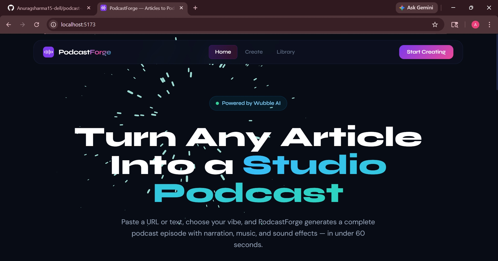

# 🎵 PodcastForge



> Generate custom background music for podcasts and content — powered by [Wubble AI](https://wubble.ai).

   

---

## ✨ Features

- 🔗 **URL Scraping** — Paste any article URL and we extract the content automatically (via Cheerio)
- 🎨 **Auto Tone Detection** — Detects content tone (tech, health, business, calm, dramatic, upbeat)
- 🎵 **AI Music Generation** — Creates instrumental background music via Wubble's Chat API
- 🎼 **Tone-Aware Styles** — Music matched to content mood (electronic, ambient, corporate, etc.)
- 📦 **MP3 Export** — Download the generated music tracks (30 seconds, extendable)
- 🗂️ **Library** — All your generated music saved in MongoDB
- ⚡ **Real-time Polling** — Live status updates while Wubble generates your music

---

## 🏗️ Architecture

```
User Input → Express Backend → Wubble Chat API → Poll for completion → MongoDB → React Frontend
```

### Tech Stack

| Layer | Technology |
|-------|-----------|
| Frontend | React 18 + Vite, TailwindCSS, Framer Motion, React Router |
| Backend | Node.js + Express + TypeScript |
| Database | MongoDB + Mongoose |
| AI Audio | Wubble AI API (Chat + Polling) |
| Scraping | Axios + Cheerio |

---

## 🚀 Quick Start

### 1. Prerequisites

- Node.js 18+
- MongoDB running locally (`mongod`) or a MongoDB Atlas URI
- A [Wubble AI](https://wubble.ai) account and API key

### 2. Get Your Wubble API Key

1. Sign up at [wubble.ai](https://wubble.ai)
2. Go to the API section in your dashboard
3. Create a new API key

### 3. Clone & Install

```bash
# Clone the repo
git clone <repo-url>
cd musicforge

# Install all dependencies
npm install
npm run install:all
```

### 4. Configure Environment

```bash
cd server
cp .env.example .env
```

Edit `server/.env`:

```env
PORT=3001
MONGODB_URI=mongodb://localhost:27017/musicforge
WUBBLE_API_KEY=your_actual_wubble_api_key
WUBBLE_BASE_URL=https://api.wubble.ai
CLIENT_URL=http://localhost:5173
```

### 5. Run the App

**Terminal 1 — Backend:**
```bash
cd server
npm run dev
```

**Terminal 2 — Frontend:**
```bash
cd client
npm run dev
```

Or run both with concurrently from root:
```bash
npm install  # installs concurrently
npm run dev
```

Open [http://localhost:5173](http://localhost:5173) 🎉

---

## 📁 Project Structure

```
musicforge/
├── server/                   # Node.js + Express + TypeScript
│   ├── src/
│   │   ├── app.ts            # Express entry point
│   │   ├── routes/
│   │   │   └── music.route.ts
│   │   ├── controllers/
│   │   │   └── music.controller.ts
│   │   ├── services/
│   │   │   ├── wubble.service.ts    # Wubble API integration
│   │   │   ├── scraper.service.ts   # URL scraping with Cheerio
│   │   │   └── tone.service.ts      # Tone detection + prompt building
│   │   └── models/
│   │       └── music.model.ts       # MongoDB schema
│   └── .env.example
│
└── client/                   # React + Vite + TailwindCSS
    ├── src/
    │   ├── App.jsx
    │   ├── pages/
    │   │   ├── LandingPage.jsx   # Hero + features
    │   │   ├── CreatePage.jsx    # Input form + generation flow
    │   │   ├── StudioPage.jsx    # Audio player + download
    │   │   └── LibraryPage.jsx   # All music tracks
    │   ├── components/
    │   │   ├── Navbar.jsx
    │   │   ├── AudioPlayer.jsx   # Full-featured player
    │   │   ├── Waveform.jsx      # Animated waveform canvas
    │   │   └── GeneratingLoader.jsx
    │   └── services/
    │       └── api.js            # Axios API calls
    └── tailwind.config.js
```

---

## 🔌 API Endpoints

| Method | Endpoint | Description |
|--------|----------|-------------|
| `POST` | `/api/music/generate` | Start music generation |
| `GET` | `/api/music/status/:id` | Poll generation status |
| `GET` | `/api/music/all` | List all music tracks |
| `DELETE` | `/api/music/:id` | Delete a music track |
| `GET` | `/health` | Server health check |

### POST `/api/music/generate`

```json
{
  "input": "https://techcrunch.com/article OR raw text here...",
  "voice": "deep_narrator | friendly | professional",
  "tone": "auto | tech | health | business | calm | upbeat | dramatic"
}
```

Response:
```json
{
  "id": "mongodb-object-id",
  "status": "generating",
  "requestId": "wubble-request-id",
  "projectId": "wubble-project-id",
  "title": "Extracted title",
  "tone": "tech"
}
```

---

## 🔑 Wubble API Integration

MusicForge uses the Wubble Chat API:

1. **`POST /api/v1/chat`** — Sends a prompt describing the desired instrumental music
2. **`GET /api/v1/polling/:requestId`** — Polls every 4 seconds until `status === 'completed'`
3. Returns `audio_url` / `output_url` for MP3 playback and download

The prompt engineering builds instructions that specify:
- The content topic for context
- Tone-appropriate music style (electronic, ambient, corporate, etc.)
- Duration (30 seconds default, extendable)
- MP3 format, royalty-free

---

## 🎨 Design System

- **Font**: Syne (display) + DM Sans (body) + JetBrains Mono (code/metadata)
- **Colors**: Deep navy `#080b14` bg, purple/pink gradient accents, glassmorphism cards
- **Animations**: Framer Motion page transitions, waveform canvas animation, pulsing orbs

---

## 📝 Notes

- Wubble generation typically takes 30–90 seconds
- The frontend polls every 5 seconds for status updates
- Content is limited to ~3000 characters for optimal TTS quality
- 100 Wubble credits are deducted per generation

---

